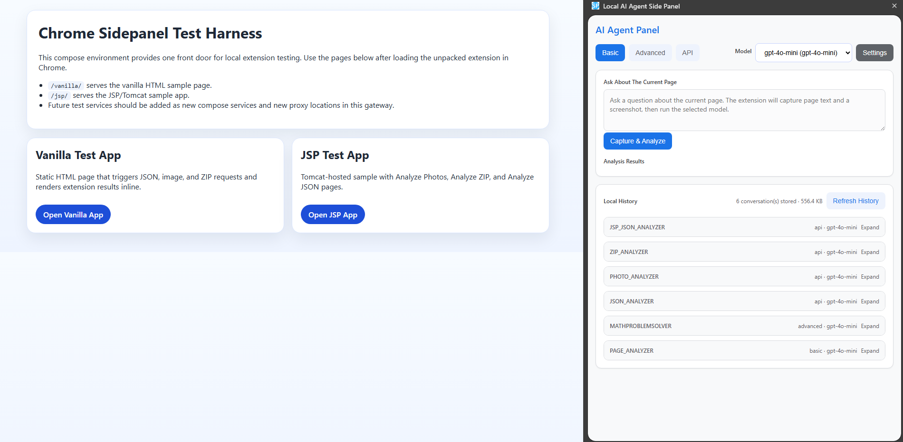
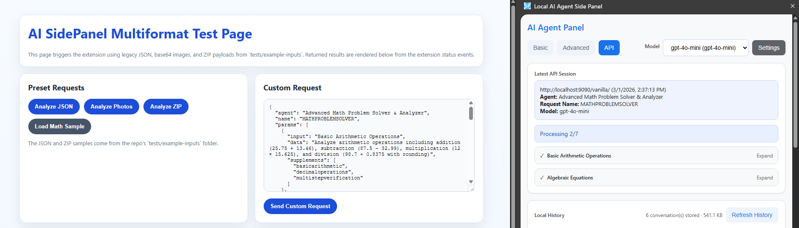
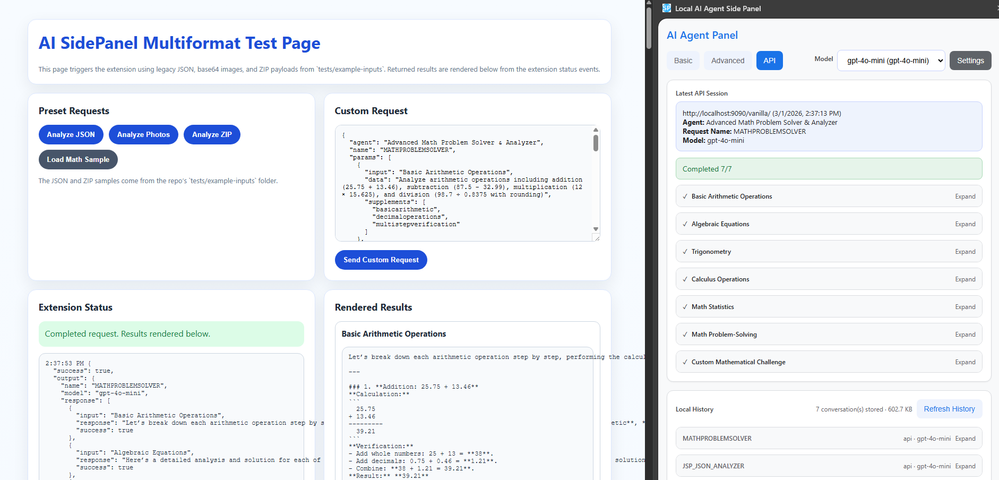
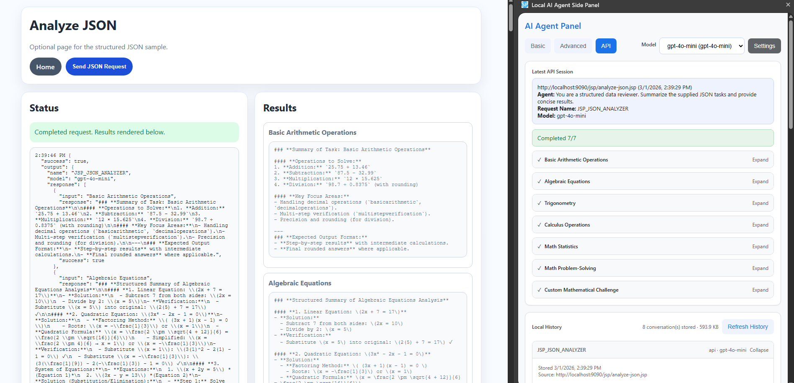

# Chrome AI Side Panel

A Chrome extension that adds an AI-powered side panel to your browser. It connects to any OpenAI-compatible backend and supports chat conversations, multimodal inputs (text, images, ZIP archives), skill-based automation, and external page integration.

## Project Structure

```
ai-sidepanel/          Chrome extension source (Manifest V3)
skill-launcher/        Backend app for skill-runner CLI execution
tests/                 Docker-based test harness (vanilla HTML + JSP demos)
assets/                Screenshots for documentation
```

| Component | Description |
|-----------|-------------|
| **[ai-sidepanel/](ai-sidepanel/README.md)** | The Chrome extension — side panel UI, service worker, content scripts, settings, storage, skills engine |
| **[skill-launcher/](skill-launcher/README.md)** | Python backend that receives runner payloads from the extension and executes CLI tools (Claude, Copilot, Cursor) |
| **[tests/](tests/Tests.md)** | Docker Compose test harness with vanilla HTML and JSP sample apps |

## Quick Start

### 1. Install the extension

1. Open `chrome://extensions/`
2. Enable **Developer mode** (toggle in top-right)
3. Click **Load unpacked**
4. Select the `ai-sidepanel` folder

### 2. Configure settings

1. Right-click the extension icon → **Options** (or open `chrome://extensions` → extension details → Extension options)
2. Set your **API Base URL** and **API Key** for an OpenAI-compatible endpoint
3. Add one or more **models** (mark vision-capable models with the **Vision** checkbox) and select a default
4. Set the **Default Chat Mode** (Chat or Skill)
5. Save settings

### 3. Use the side panel

1. Click the extension icon in the toolbar to open the side panel
2. Type a message in the chat input and press Enter
3. The extension sends your message to the configured API and displays the response

## Features

### Chat Interface
The primary interface is a chat window in the side panel. Two modes are available:

- **Chat mode** (default) — Multi-turn conversation sent as an OpenAI-compatible `messages` array. Works like a standard chatbot.
- **Skill mode** — Routes messages through a skill runner (Claude, Copilot, or Cursor CLI) with accumulated conversation context.

Additional sidepanel features:
- **Default Chat Mode** — Configurable in Settings (Chat or Skill). Persisted in extension storage.
- **Additional Instructions** — A free-text field in the sidepanel forwarded to the skill launcher as `SKILL_RUNNER_ADDITIONAL_INSTRUCTIONS` and injected into the CLI prompt, letting users add per-request guidance without modifying skill definitions.
- **Include Screenshot** — Visible when the selected model is marked vision-capable in settings. Captures the visible tab as 1280×720 tiles and attaches them as `image_url` content blocks. Re-captures only when the active tab URL changes.

### Extension Modes
- **Developer mode** — Shows Basic (Chat), Advanced, and API tabs
- **User mode** — Shows only the chat interface with settings and history access

### Multimodal Input
- Text prompts
- Base64/data-URL image payloads
- ZIP archives containing JSON, text, and image files
- Optional active-tab page content and screenshots
- Full-page screenshot capture (split into 1280×720 tiles) when the selected model is vision-capable

### Skills
- Skills are loaded from a configured repository URL (directory of `.skill` ZIP packages)
- Each package contains a `SKILL.md` with metadata and instructions
- Skills are periodically refreshed and can be enabled/disabled individually in settings
- Selected skills are injected into the system prompt during API calls

### Skill Runner
- Bypass the API and route requests to a local or remote CLI runner (Claude, Copilot, Cursor)
- Requests are queued with status tracking (queued → running → completed/failed/timed_out)
- The [skill-launcher](skill-launcher/README.md) backend handles execution and skill sync
- Launcher extracts page context from the active tab URL and page text (UserID, UniqueID, timezone) and injects extracted values into the CLI prompt automatically

### External Page Integration
Any web page can trigger the extension via a custom DOM event:

```js
document.dispatchEvent(new CustomEvent('ai-sidepanel-api-call', {
  detail: requestObject
}));
```

Results are dispatched back as `ai-sidepanel-response` and `ai-sidepanel-status` events.

### Storage
- **IndexedDB** — Conversation history (input/output)
- **chrome.storage.local** — Settings, extension mode, skills state, queue state
- Storage usage is displayed in settings with a **Clean Storage** action

## Screenshots






## Testing

A Docker Compose harness is provided under `tests/`. See [tests/Tests.md](tests/Tests.md) for details.

```bash
docker compose -f tests/docker-compose.yml up --build
# Open http://localhost:9090/
```

## Documentation

- [Extension detailed docs](ai-sidepanel/README.md) — Settings, request formats, chat modes, skill runner flow, storage
- [Skill Launcher docs](skill-launcher/README.md) — Remote/native modes, env vars, task APIs, verbose logging
- [Test plan](tests/Tests.md) — Compose harness, vanilla HTML and JSP test pages
- [Progress log](Progress.md) — Feature implementation history
- [Agent notes](Agent-Notes.md) — AI-generated implementation findings and constraints

## Contributing

Contributions are welcome. See `Todo.md` for open items and `Progress.md` for implementation history.

The project was inspired by [Chrome Extension Samples](https://github.com/GoogleChrome/chrome-extensions-samples), especially the [sidepanel-global](https://github.com/GoogleChrome/chrome-extensions-samples/tree/main/functional-samples/cookbook.sidepanel-global) example.

## License

See [LICENSE](LICENSE).